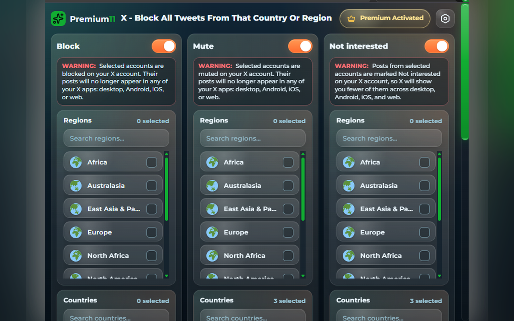

<div align="center">

# X - Block All Tweets From That Country Or Region

**Block or mute X accounts by country or region — straight from the timeline.**

A Chromium (Manifest V3) extension for x.com: it reads each account's public
"About this account" location, marks posts with their country or region, and
lets you block, mute, or mark not-interested **by geography** — each lane
independent.

`License: MIT` · `Platform: Chrome 111+ (MV3)` · `Node: 18+ (dev)` · `Locales: full Chrome Web Store catalog`

</div>

---

## What it is

X shows some accounts a public "About this account" location. This extension
turns that into a filter: pick the countries or regions you do not want on your
timeline, and matching posts get handled by your chosen lane.

| Lane | What it does |
|---|---|
| **Block** | Blocks the author when their location matches a country or region you selected. |
| **Mute** | Same matching, lighter action. |
| **Not interested** | Tells X to show less like it — nothing irreversible. |

The three lanes are independent: each has its own countries, regions, and
manually managed accounts list.

Also included:

- **Timeline marks** — an optional flag and country label next to usernames, read from X's public About-account data.
- **Managed lists** — every action lands in a per-lane list you can review and undo from the popup.
- **Local geo cache** — an IndexedDB cache on your device makes repeat lookups instant. It is never uploaded.

## How it works

```
timeline ─▶ username detected ─▶ location lookup (About this account, X's own API, as you)
                                        │
                                        ▼
                       country / region matched against your enabled lanes
                                        │
              ┌─────────────────────────┼─────────────────────────┐
              ▼                         ▼                         ▼
         Block lane                 Mute lane             Not interested lane
              └─────────────────────────┬─────────────────────────┘
                                        ▼
                     X's own menu action  +  in-page toast  +  session badge
```

Lookups run from your logged-in x.com page against X's own GraphQL API, through
a serial queue (one action at a time). Actions are applied by driving X's own
Block / Mute / Not-interested menu — the same clicks you would make by hand.
Full detail: [`docs/architecture.md`](docs/architecture.md).

## Install

**Quick start:** end users install from the Chrome Web Store (below); developers build from source in three commands.

### From the Chrome Web Store (recommended)

**[X - Block All Tweets From That Country Or Region](https://chromewebstore.google.com/detail/obpgcigehkijhgjdldddiaijimhihpma)**

End users do not need this repository.

### From source (developers)

```bash
git clone https://github.com/LisandroNahuelH/x-block-all-tweets-from-that-country.git
cd x-block-all-tweets-from-that-country
npm run verify
```

1. Open `chrome://extensions`
2. Turn on **Developer mode**
3. **Load unpacked** → select the `dist/` folder

On Windows, `install/install.ps1` automates exactly those steps (dry run:
`install/install.ps1 -WhatIf`). Agents: follow [`AGENTS.md`](AGENTS.md).



## Requirements

- **Chrome 111+** on any Chromium browser (Manifest V3). Not available for Firefox.
- **Node 18+** for the dev path (build and checks). Zero npm dependencies — nothing to install.
- **Windows v1** for `install/install.ps1`; the build itself is plain Node and runs on any OS.

## What this repository touches

| Piece | What it is | Where it lands |
|---|---|---|
| `extension/` | the extension source (plain JavaScript, MV3) | built into `dist/`, loaded unpacked |
| `dist/` | build output of `npm run build` | gitignored; the "Load unpacked" target |
| `install/` | Windows dev installer + uninstaller, and a POSIX refusal stub | runs in place; nothing else |
| `%LOCALAPPDATA%\Premium11\...` | installer log, lock and status file | written only when you run the installer |
| Your Chrome profile | the extension's settings and geo cache | stays inside the browser; removed when you remove the extension |

## Privacy & the heartbeat (disclosure)

The extension sends a small **pseudonymous heartbeat** to the publisher's
server: an `install` / `update` event when it is installed or updated, and a
daily `ping` when you open the popup.

- **Sent:** a random install ID (UUID, stored in your browser), the extension version, the event name, your UI language, and your timezone.
- **Not sent:** no tweets, no usernames, no page URLs, no browsing history.
- **Endpoint:** `https://www.premium11.com/api/heartbeat` (operated by the publisher). On uninstall, Chrome opens a farewell page with the same install ID and version.
- **The key inside `shared/heartbeat.js` is a public client identifier** — it ships inside every released build and is not a secret.
- There is no analytics opt-out in the current version; blocking the domain at the network level silences the heartbeat.

The country/region cache lives in IndexedDB on your device and is never
uploaded. Details: [`SECURITY.md`](SECURITY.md).

## Security & trust

- **Manifest V3, no remote code.** Everything the extension runs is in this repository.
- **Declared surface only:** `storage` and `unlimitedStorage`, plus host access to `x.com`, `twitter.com`, X's image CDNs, and `premium11.com` (heartbeat + links).
- **Audit the pinning:** `npm run versions:check` verifies that the files named in `versions.json` match their published sha256 — anyone who clones this repo can run it.

## Limits (honest ones)

- Detection depends on X exposing a public "About this account" location; accounts without one are left alone.
- Actions depend on X's current menu structure — a UI change can break them until `extension/content/engine/actions.js` is updated.
- The installer is Windows-only in v1; the build itself is plain Node and runs anywhere.
- `npm run verify` checks mirrors, locales and the build — there is no automated test suite yet.
- Not affiliated with X Corp. Full list: [`docs/limits.md`](docs/limits.md).

## Uninstall

- **Store install:** remove it from `chrome://extensions` (or the Chrome Web Store). Your blocks and mutes stay on X — undo them from the popup first, or from X itself.
- **Source install:** remove the unpacked extension in `chrome://extensions`, then run `install/uninstall.ps1` to clear `dist/` and the installer state.

## Documentation

| Doc | For |
|---|---|
| [`AGENTS.md`](AGENTS.md) | the installing agent — runbook + verification |
| [`docs/architecture.md`](docs/architecture.md) | how it works: data flow, contracts, file map |
| [`docs/limits.md`](docs/limits.md) | what is guaranteed, and the edges |
| [`docs/troubleshooting.md`](docs/troubleshooting.md) | logs, probes, recovery |
| [`docs/i18n/`](docs/i18n/) | the localization program |

## FAQ

<details><summary>Does it send my timeline or my data anywhere?</summary>

No. Lookups run in your browser against X's own API, and the country cache
stays in IndexedDB on your device. The only outbound call is the pseudonymous
heartbeat described above.
</details>

<details><summary>Why doesn't it detect a country for some accounts?</summary>

Only accounts where X publishes an "About this account" location can be
matched. Private or missing locations are left untouched — this is a filter,
not a fingerprinting tool.
</details>

<details><summary>Does it work on Firefox?</summary>

No. It is built for Chromium (Chrome, Edge, Brave, and other Chromium browsers).
</details>

<details><summary>How do I undo a block or mute?</summary>

Every action is recorded in the lane's managed list in the popup, with an undo
path. Blocks and mutes also appear in your X settings as usual.
</details>

<details><summary>What is the Premium panel in the popup?</summary>

A status panel from the publisher (Premium11) that shows gift/activation state
and release facts. Details live on [premium11.com](https://www.premium11.com/).
</details>

<details><summary>Is this an official X product?</summary>

No. See the disclaimer below.
</details>

## Credits & disclaimer

Detection approach inspired by [xaitax/x-account-location-device](https://github.com/xaitax/x-account-location-device)
(MIT; used with the author's authorization — see [THIRD_PARTY_NOTICES.md](THIRD_PARTY_NOTICES.md)).
The action engine was ported from our earlier extension
[I Don't Care About Your Tweets](https://chromewebstore.google.com/detail/heeojjceomdehhpmabjebblocohkfbig).

**Not affiliated with, endorsed by, or sponsored by X Corp.** "X" and "Twitter"
are trademarks of X Corp. The Premium11 name, logo, and store artwork are
project assets and are not covered by the MIT license.

MIT © 2026 Lisandro Nahuel H — see [LICENSE](LICENSE).
